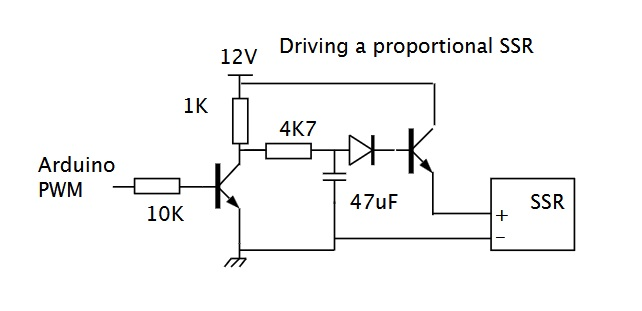

# Solar powered heating rod

Diese Schaltung steuert einen Heizstab in Abhängigkeit eines solaren Heim-Netzüberschusses an.

Achtung: Bei dieser Schaltung muss bei Anschluss an das Stromnetz die TAA des jeweiligen Energieversorgungsunternehmen beachten werden , sowie die jeweiligen VDE-Vorschriften!

Ein W5100S-EVB-Pico steuert über ein PWM ein Solid State Relais an, an dem ein Elektroheizstab angeschlossen ist.

Bestimmte Eingabewerte wie der aktuelle Netzbezug, die aktuelle Solare Leistung und die Lade/Entladeleistung der Batterie wird über ein MQTT-Broker empfangen, und daraus eine Stellgröße für den Elektroheizstab berechnet.

Das Programm selber ist in Micropython geschrieben. Die Stellgröße für die richtigen PWM-einstellungen wurden vorher ausgemessen und in der Variable power2pwmList gespeichert. Es ist also kein Regler, sondern ein simpler Steller. Der Elktroheizstab hat einen 3 phasigen Anschluss. Es wird nur ein Anschluss über eine PWM angesteuert, die anderen 2 werden dann nur zu oder abgeschaltet.

